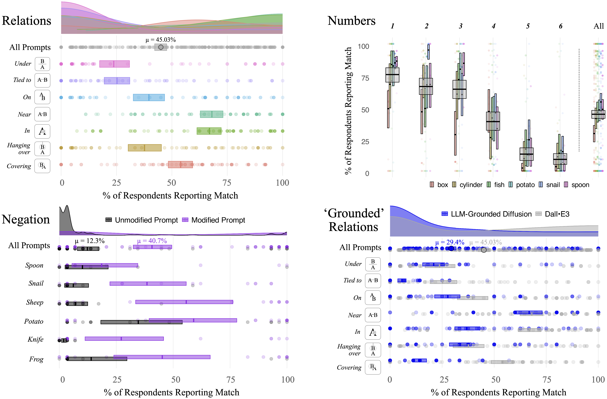

# T2I-Probology

Experimental results and resources for probing compositional structure in OpenAI's DallE-3 and other generative text-to-image (T2I) models.

Coming soon... (With the release of the accompanying manuscript on arXiv.)

